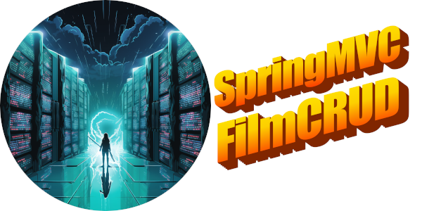

# SpringMVCFilmCRUD

Week 8 homework by Dean Coffman and Justin Martz

## Description

Our website offers users three options: search film database by film ID, search by keyword, or create a new film. 

When the user searches by ID, the entered film ID is used by the application logic to query the database for the corresponding film entry, and is then displayed. As the film data is displayed, corresponding data from associated tables are also displayed such as genre and a list of actors. A form to edit the film's data is also presented to the user, with the film's existing data as pre-populated fields.

When the user searches by keyword, a similar process happens where the keyword is used in the film query and returns a list of films where the keyword appears in either a film's title or description. A display of film data shows with any and all of the films returned, as well as a form to edit film data for each film listed.

Lastly, when the user clicks the button to create a new film, user is taken to another page to enter in film data.

## Technologies Used

- Java Database Connectivity API

- Java String Tag Library

- Jakarta Server Pages

- Spring MVC

- MySQL

- HTML / CSS / Bootstrap

- Mural collaboration software

## Lessons Learned

- <strong>Using git</strong>: This assignment really highlighted the importance of commits, pushes, and pulls. We got stuck at one point with merge conflicts and had TAs show us how to work through it.

- <strong>Putting together all the components we've been learning (MySQL, Spring, Java) into one working application:</strong> Having to put this application together by ourselves solidified how to use Spring/Java to talk to a database and then talk to a web site using forms to take in data from a user. It also solidified the concept of the MVC design pattern.

- <strong>Pair programming</strong>: we learned a lot about how pair programming works on our first multi-day timeline. Figuring out solutions on our own, having a second pair of eyes look at the code and offer different ways to figure out a problem, communication (especially about who is pushing and when to pull) and planning.